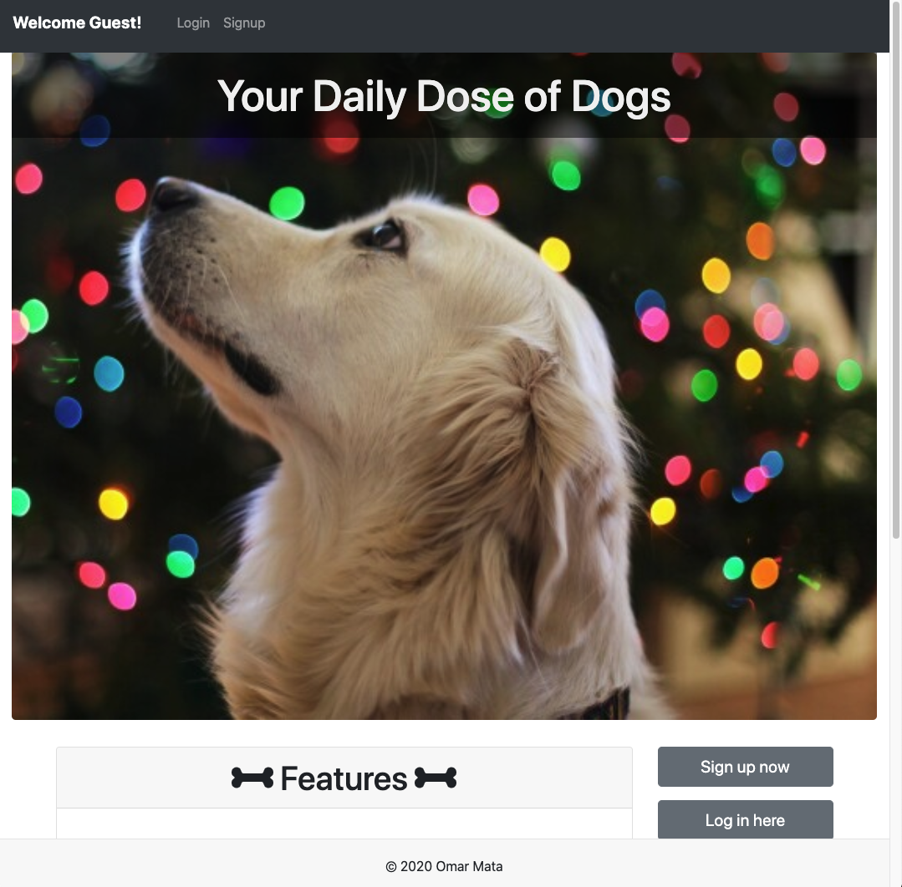
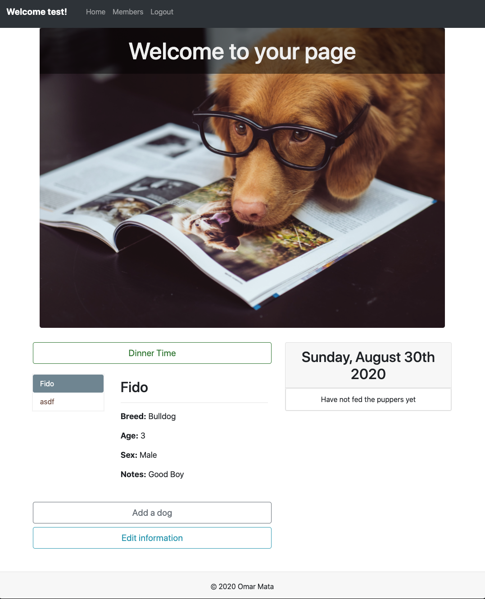

# Online/Offline Budget Trackers

  

## Description
[SITE](https://puppers-daily.herokuapp.com/) |
[GIT REPO](https://github.com/omata48/Puppers-Daily)

>With multiple dogs, it would be nice to have a central place to keep your pack’s information with a daily usefulness.  

Most dog applications on the market focus on finding lost dogs or tracking health information of pets. This is an application focused on the daily interactions with your dogs.

This application can also be installed by users on a mobile device by following the instructions under [Installation](#Installation).

## Table of contents
[Installation](#Installation)  
[Usage](#Usage)  
[License](#License)  
[Contributing](#Contributing)  
[Technologies Used](#Technologies%20Used)  
[Features](#Features)  
[Questions](#Questions)  

## Installation
Install initial detabase from db/schema.sql and dependencies from package.json

    npm install

To install web app on mobile devices:

* iOs:

  * 1. Navigate to https://puppers-daily.herokuapp.com/ with Safari.

  * 2. Tap the Share button in Safari.

  * 3. Tap the icon labeled Add to Home Screen.

  * 4. Tap Add in the upper-right corner.

  * 5. Rename your App if you want, then tap Add in the upper-right corner.

* Android:

  * 1. Navigate to https://puppers-daily.herokuapp.com/ with Chrome.

  * 2. Tap the menu button in the upper right corner of Chrome.

  * 3. Tap the icon labeled Add to Home Screen.

  * 4. Rename your App if you want, then tap Add below the promp.

## Usage
Start the application on your local server

    npm start

## License
  
Licensed under the [MIT license](LICENSE).

## Contributing
Contributions welcomed by forking repo and submitting a pull request with any feature requests

## Technologies Used
* React.js
* mySQL
* React-Bootstrap
* Sequalize
* Express
* Node.js
* CSS
* Heroku

## Features

* Users have personalized profiles
* Add new dogs
* Edit notes about their dogs
* Delete dogs from their list
* Add time fed
* Delete feeding instance

## Questions

Link to my [GitHub Profile](https://github.com/omata48)  
For additional questions feel free to email omata48@outlook.com